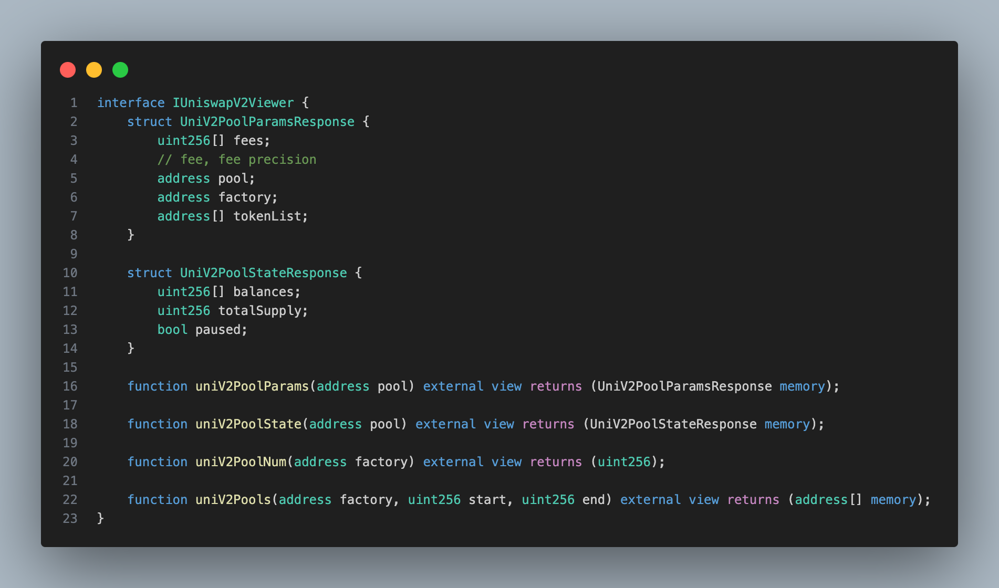
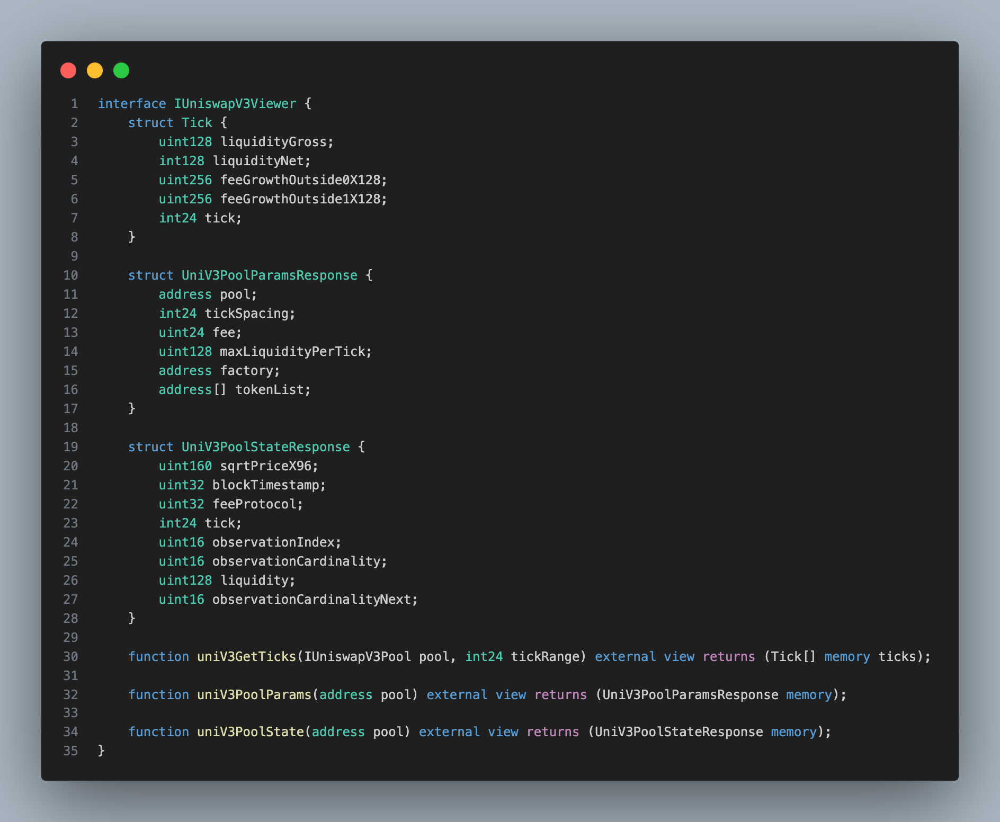

# EISEN smart contract router

<!-- TABLE OF CONTENTS -->
<details>
  <summary>Table of Contents</summary>
  <ol>
    <li>
      <a href="#getting-started">Getting Started</a>
      <ul>
        <li><a href="#prerequisites">Prerequisites</a></li>
        <li><a href="#installation">Installation</a></li>
        <li><a href="#modification">Modification</a></li>
      </ul>
    </li>
    <li><a href="#permit2">Permit2</a></li>
    <li><a href="#repository-structure">Repository Structure</a></li>
    <li><a href="#more-information">More Information</a></li>
    
  </ol>
</details>

<!-- GETTING STARTED -->

## Getting Started

EISEN Smart Contract Router, inspired by the innovative [LI.FI smart contracts](https://github.com/lifinance/contracts), is designed to streamline and enhance the efficiency of decentralized finance (DeFi) aggregation. This document provides a comprehensive guide to get you started with our project, including setting up your development environment, installing necessary components, and making modifications to integrate new DeFi protocols.

### Prerequisites

- Install [rust](https://www.rust-lang.org/tools/install)

  ```sh
  curl --proto '=https' --tlsv1.2 -sSf https://sh.rustup.rs | sh
  ```

- Set up to rust nightly

  ```sh
  rustup default nightly
  ```

- Install [foundry](https://book.getfoundry.sh/getting-started/installation)
  ```sh
  curl -L https://foundry.paradigm.xyz | bash
  ```
- Set up to foundry nightly

  ```sh
  foundryup
  ```

### Installation

- git submodule set up
  ```sh
  git submodule update --init --recursive
  ```
- Set up .env you can
  See .env.example file and set up .env file

- Package install
  ```sh
  npm install
  ```

<p align="right">(<a href="#top">back to top</a>)</p>

### Modification

If you want to be integrated to Eisen DEX aggregator, follow these steps.

```
npm run codegen
```

### Let's assume we add UniV3 DEX

```
? Give this facet a name: UniV3(Your DEX Name)
```

```
? Describe what this facet does: It executes the swap/management of liquidity in UniV3 pools.
```

```
✔  ++ /contracts/Facets/UniV3Facet.sol
```

### From the solidity code generated from plopfile, write contracts

- Add DEX pool interface to the [./contracts/Interfaces](./contracts/Interfaces) folder with the name of IDEXPool.sol
  - Define the IDEXViewer interface and make structs of DEXPoolParamsResponse & DEXPoolStateResponse
  - Define the functions to fetch each pool info(params & state)
  - Add events which are raised in state changes in the pool
- DEXFacet.sol at [./contracts/Facets](./contracts/Facets)
  - Fetching the params of DEX pools (ex: uniV3PoolParams)
  - Fetching the states of DEX pools(which can be changed in block basis) (ex: uniV3PoolState, uniV3GetTicks)
  - Swapping / Adding liquidity / Removing liquidity functions which change storage values of DEX pools (ex: uniV3SwapExactInput)

In UniV2Facet,



If you want to deal with ticks like concentrated liquidity market maker styles, you should add tick related struct and functions.

In UniV3Facet,



If the pools deployed from the factory are stored in mapping structure, subgraph info(urls, scheme) should be given in eisen-exchange repo in [subquery folder](../eisen-exchange/subquery/) in the name of snake_case_dex_name folder.

```
forge build
```

### After compile, copy the contract-abi json files from [out/DEX.sol/DEX.json](./out), paste to [../lib/bindings/contract-abi](../lib/bindings/contract-abi)

### Build for rust files generated from json files.

You can just press Ctrl+S for build.

Now you are ready to integrate rust integration.

<p align="right">(<a href="#top">back to top</a>)</p>

# Permit2

EisenDiamond integrates [permit2](https://github.com/Uniswap/permit2) contract that allows users to approve token transfers without having to set an allowance on the token to other router. This makes token approvals more convenient and secure, as it eliminates the need to trust the spender with an unlimited allowance and no expiration.

Permit2 works by using a signature-based approval mechanism. To approve a token transfer using Permit2, the user signs a message that authorizes the spender to transfer a certain amount of tokens on their behalf. This message is then passed to the Permit2 contract, which verifies the signature and approves the transfer.

Permit2 is useful for convenience because it allows users to approve token transfers without having to explicitly set an allowance on the token. This is especially useful for users who use many dApps and need to approve token transfers on a regular basis, such as traders or liquidity providers.

<p align="right">(<a href="#top">back to top</a>)</p>

# Repository Structure

```
.
├── contracts                // Smart contract code
│   ├── Errors               // Custom error definitions
│   ├── Facets               // Contract facets for modular functionality
│   ├── Interfaces           // Interface definitions for external interactions
│   └── Libraries            // Reusable contract libraries
├── imgs                     // Images and code snippets for documentation
├── lib                      // Submodule dependencies and libraries
└── README.md                // Project documentation and guide
```

<p align="right">(<a href="#top">back to top</a>)</p>

# More Information

- [Website](https://eisenfinance.com/)
- [Email](information@eisenfinance.com)
<p align="right">(<a href="#top">back to top</a>)</p>
